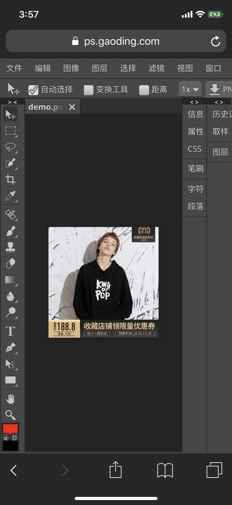

# 这个不懂框架的程序员，颠覆了我对前端基础的认知

现在正值跳槽季，满天飞的 JD 里要求也是越来越高大上了。假设你作为前端面试官收到了这样的一份简历，你会让他过吗？

* 大学毕业后的几年，无正式工作，无任何公司项目经验，纯做个人项目玩。
* 不懂前端框架，Vue / React / Angular 全都没用过。
* 不懂 ES6，写的 ES5 还满地丑陋的 for 循环。
* 不懂工程化，没用过 Webpack / Gulp 之类的工具。
* 不懂全栈开发，更不会用 Node。

我猜掘金上的大神们，遇到这样的简历多半只会丢下一句「基础很差」然后淘汰掉吧。是嘛，这完全不像是一个自信的前端该有的样子。但是，就这样的一个在国内的评价体系下大概率被弃如敝履的人，写出了一个能在浏览器里运行的 **Photoshop**，我们刚刚把它部署上线了：

**[ps.gaoding.com](https://ps.gaoding.com)**

它不光支持常规的图文排版：

魔棒、快速选择和钢笔之类的操作也不在话下：

还带了各种图片混合模式和滤镜：

甚至在手机和 iPad 上也「又不是不能用」：

肯定有很多同学会抗议：这肯定是个大团队开发了很多年，或者有现成的开源框架可以用啊 blabla 的。强调一下重点：

**这全都是他一个人的作品。**

听起来明显不可能啊——「连 Vue / React 都不会的人，基础肯定很差，哪里写得出靠谱的东西嘛」。所以，这到底是怎么一回事呢？

话说有位家住捷克布拉格的少年伊万，从小就有画画和数学的特长，还特别热衷于自己造轮子。上大学的时候他偶然地搞起了网页版的图片编辑器，一开始的时候这也就是做着玩玩，不曾想到这回搞的事情和之前的玩具不一样，还真有不少人非常乐意用。于是，伊万同学决定正经把它做大做强。一晃几年过去了，伊万的编辑器在解了上千个 bug 和需求以后，居然一举成为了 Web 图片编辑界的老大——拿 Google 搜 online ps 的话，会发现伊万的编辑器 Photopea 已然位列榜首，甚至排在 PS 亲妈 Adobe 的前面（偏个题，如果换成百度搜「在线 PS」，不出意外的话第一名就是我司旗下的编辑器，不过体验上可能有点复古…）。于是光靠着投广告，90 后伊万就有了稳定的被动收入，达成了一周工作四天，每天五小时的财务自由。而再后来，我司与伊万达成了愉快的合作，以**稿定设计**的名义将 Photopea「进口」了进来，这样国内的小伙伴们也能无缝地用上这个高质量的在线 PS 服务了。

回到技术上，单纯论 Photopea 这个项目本身，它也绝对具备世界上第一流的 Web 图片编辑体验——这和那些培训班忽悠你的 canvas 画图玩具 demo 有着本质的区别，是一个具备工业质量，且几乎不存在同类竞品的独家应用。这就带来了一个问题：**能写出这样高质量作品的作者怎么说都是个王者，凭什么按国内某些前端的评价体系来看还不到青铜呢？**

这里我要大声疾呼一句，许多前端眼里所认为的基础，只是些无关紧要的皮毛罢了！让我们看看不懂 Vue 和 React 的伊万，真正擅长的是哪些基础：

* **数据结构和算法** - 要想支持 PSD 这样没有浏览器内置支持的格式，显然需要自己实现二进制数据的解析器。同时，他也熟悉 PDF 与 TTF 等格式的绘制算法，这些可都不是教科书里的玩具，你想要，你就得照着规范自己造。
* **计算机图形学** - 想用 Canvas 实时拖拽 1000 万像素的图片，显然是荒谬的。需要熟悉 OpenGL 的光栅化渲染管线，才有可能用 GPU 加速这些复杂的图像处理流程。值得一提的是，伊万还实现过多个基于 WebGL 的 2D 与 3D 游戏，有自己的 3D 基础库，还实现过网页上的光线追踪渲染器——玩得转 3D 的人跑来搞 2D 的编辑器，这不就是真正的降维打击吗。
* **理论计算机科学** - 许多在掘金上被津津乐道，一出口即可置于鄙视链顶端的函数式编程、类型论、范畴论等学科，都是理论计算机科学的分支。在这方面伊万的水平远不止熟悉 Haskell 与 Prolog 而已，他是有理论计算机科学的正经**硕士学历**的。只不过他的博客里几乎没有与 FP 相关的内容，我只知道他自己的 JS Minifier 对于他的场景比谷歌 Closure Compiler 快 50 倍。看起来，他掌握的这些知识都是为了 Photopea 这样的实际项目服务的，他似乎对于那些空中楼阁式的「优雅」代码没有太多兴趣。
* **数学** - 线性代数、傅里叶变换、卷积，这些很多人在大学毕业后跟后辈说「学了也没用」的东西，即便只在前端领域，在需要真正硬核的「自主研发」的时候都是必须的——不会乘矩阵就玩不转 GPU，不会推傅里叶变换就解不出 JPEG 编码、不会算卷积就写不出图像滤镜…

和上面这些基础比起来，前端圈里日常津津乐道的 HTML / CSS / JS 算什么呢？这几项在伊万的技能树里也提到了，不过只是轻描淡写地一笔带过：它们都不过是 Web Standard 罢了。

那么，如何评价伊万的前端水平呢？这就好像你面试不出一个比你厉害的人到底有多厉害一样，不理解他的工作的普通人也很难全面地评价他。就我自己来说，我并不缺国内所谓「大厂」的工作经历和 offer，也贡献过一些流行的开源项目，但我在阅读他的代码的时候，仍然经常难以跟上他的「苏式技术美学」思维。只能说，我非常希望能从他那里学到更多。

相比之下，国内的前端圈实在太过于「自信」，或太过于浮躁了——仿佛只要写出个增查改删的「优雅」代码，亦或是搞懂一段犄角旮旯的代码为什么返回了个莫名其妙的结果，就能跻身鄙视链上游了。至于言必提所谓原理与本质，每每掀起工具与范式之争以换取技术优越感的叶公好龙之辈，也是多如过江之鲫，更不用说还有若干人身攻击与伸手党之徒了。

既然都说到这个地步了，那么什么才是我所理解的基础呢？理论上，所有本科计算机专业里会教的东西都算——你在从前端开始深入某个相关领域时所遇到的难题，几乎总是已经在这些课本里被 well-defined 了。并且，真的不要认为如果自己不是科班出身，就没有机会搞懂这些东西了。我个人非常喜欢尤大提过的一个「三个月」的说法：**你和有所谓专业背景的人之间的差距，往往只差三个月的持续学习**——就算是科班出身的程序员，有多少不是期末突击的呢？这种不将自己限定在 HTML / CSS / JS 小笼子里的理念，让我们看到了许多顶级前端开源项目横跨边界的成就。譬如 Babel 的作者只有高中学历，那学校里没教过编译原理就写不出来了吗？不要去给自己设限，不要怕把手弄脏，找到领域中真正核心的痛点并深入理解、解决它，这比靠泛读二手资料来骗自己「我在学习」的自我安慰，对技术深度的提升要有用得多。

---

理论上这篇文章到这里就应该要结束了，但其实由于我和本文的主角伊万以 Photopea 为契机而有了不少交集，就在这里再次分享下我们最新的合作成果 **[ps.gaoding.com](https://ps.gaoding.com)** 吧。既然原有的 Photopea 已经如此强大，你还有什么理由选择我们（**稿定设计**）部署的这个版本呢？简单说，我们的服务有这么些优势：

* 稿定版部署在国内的 CDN 上，加载更快，没有网络问题的隐患。
* 伊万的版本是有广告的，稿定版则没有广告。
* 伊万的版本自带的中文字体支持几乎为零（中文字符无法展示），稿定版则自带了完善的中文字体支持。
* 稿定版默认官方中文。顺便扯一句，我也为 Photopea 贡献了若干中文翻译。

而对于这一服务一些可能的疑虑，这里也先解答如下：

* 这个编辑器是伊万从底到上完全原创的——甚至连每一个图标都是他重绘的，只不过披着一层 PS 的壳方便上手而已。
* 所有的图片都是在你的本地打开和保存的，我们不保存任何用户数据到服务端——只要加载完，断网也能用。
* 由于网络原因，Photopea 主站仅有非常少的国内流量，稿定版不会有鸠占鹊巢的问题。
* 稿定版中自带的字体仍然可能有些是仅可供个人免费使用，但不可免费商用的。如果在意这一问题，我们提供了可以一键检测、替换商用字体，并在使用难度上简单得多的 [Web 平面设计编辑器](https://www.gaoding.com/)，欢迎尝鲜 :)

祝大家用得顺心！使用过程中的任何问题，欢迎反馈噢~
