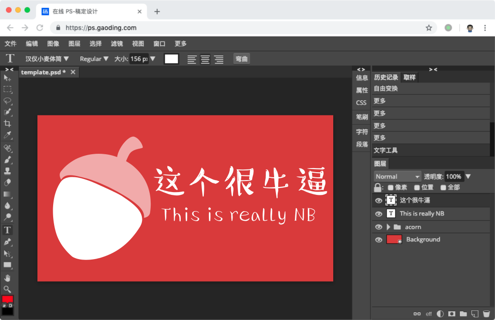
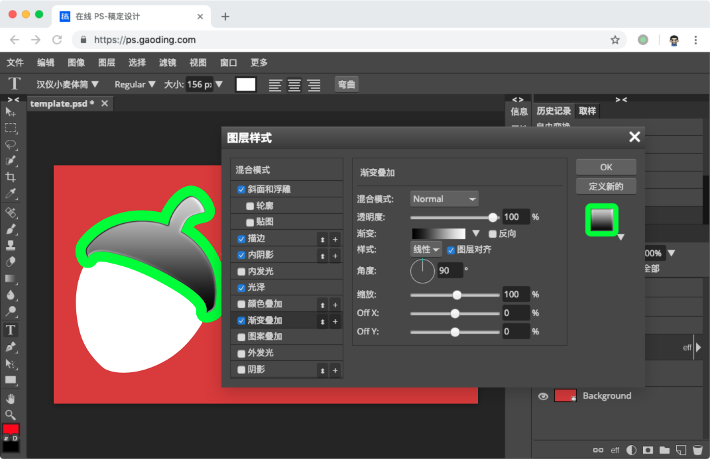
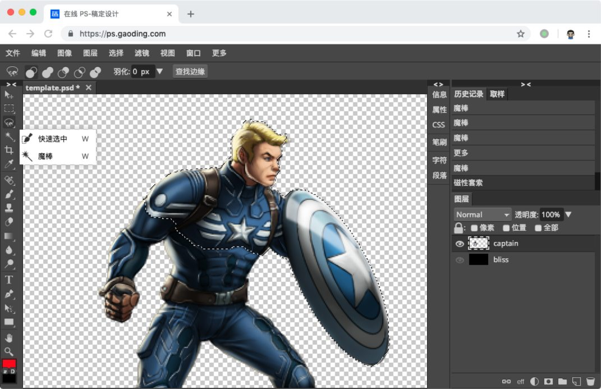
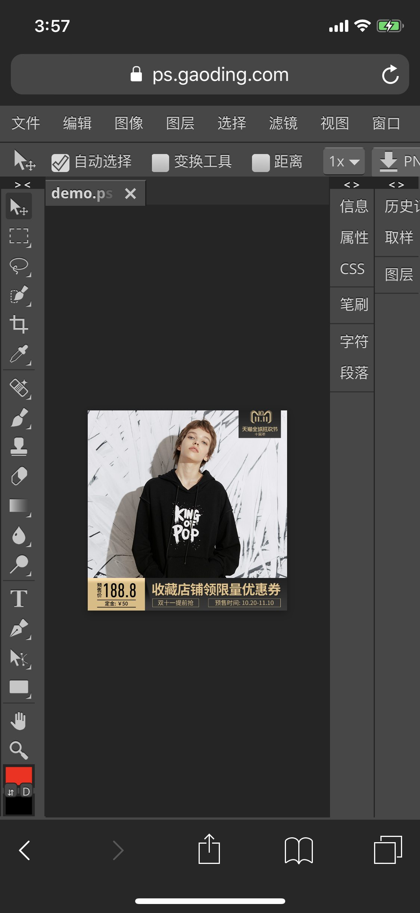

# 你认识的程序员，写得出这个免费的在线 PS 吗？

我们都知道，要想践踏程序员的自尊心，可以问他能不能两千块帮你写个淘宝出来。那还能更过分一点吗？你不妨问问，他能不能帮你写个 PS 出来——不用太专业，什么滤镜蒙版印章钢笔矢量之类的都能用就行，只限一个人写，然后不收钱，免费给你用。

听起来是不是天方夜谭？请珍惜每个这时还没有拉黑你的程序员。不过，一个人单枪匹马写出来的 (almost) 全功能免费 PS，这样的项目还真的存在——并且不用下载安装不用注册激活，只要打开这个链接，就能马上用到：

[ps.gaoding.com](https://ps.gaoding.com)

它不光支持常规的图文排版：

魔棒、快速选择和钢笔之类的操作也不在话下：

还带了各种图片混合模式和滤镜：

甚至在手机和 iPad 上也「又不是不能用」：

相比于去问「能不能免费帮我做个 PS」，而是把这个链接转给你认识的程序员，问他「这个你做得出来吗」的话，你多半会得到个客气点的「这肯定要一个大团队开发很久啊 blablabla」之类的说法。这时候就到重点了：

**这玩意 TM 还真是一个人写出来的。**

话说有位家住捷克布拉格的少年伊万，热衷于鼓捣各种有趣的硬核代码，从 Flash 小游戏到 3D 光线追踪不一而足。上大学的时候他偶然地搞起了网页版的图片编辑器，一开始的时候这也就是做着玩玩，不曾想到这回搞的事情和之前的玩具不一样，还真有不少人非常乐意用。于是，伊万同学决定正经把它做大做强。一晃几年过去了，伊万的编辑器在解了上千个 bug 和需求以后，居然一举成为了 Web 图片编辑界的老大——拿 Google 搜 online ps 的话，会发现伊万的编辑器 [Photopea](https://photopea.com) 已然位列榜首，甚至排在 PS 亲妈 Adobe 的前面（偏个题，如果换成百度搜「在线 PS」，不出意外的话第一名就是我司旗下的编辑器，不过体验上可能有点复古…）。于是光靠着投广告，90 后伊万就有了稳定的被动收入，达成了一周工作四天，每天五小时的财富自由。话说再后来，我司与伊万达成了愉快的合作，以稿定设计的名义将 Photopea「进口」到了国内，这样境内的小伙伴们也能无缝地用上这个高质量的在线 PS 服务了。

也许有的同学会问，这真的没有抄 PS 吗？确实，这个编辑器的界面和 PS 很相似，但这也是这个领域所有合法存在的专业编辑器的共性。并且，它的代码完全是伊万一个人从底到上原创实现的，甚至还有些字体、图像编解码的底层库开源出来贡献给了社区。作为折腾过这些轮子的程序员，笔者可以说它们的代码带有着明显的「苏俄技术美学」痕迹——粗犷皮实，自成体系。至于现在国内前端程序员热衷的 React / Babel / Webpack 等应用层的「美系」技术，伊万更是一概不用。是的，从像素渲染到业务逻辑，这就是个代码从底到上原创的图片编辑器，只不过披着一层 PS 的壳而已。

不过这可能就带来了另一个疑惑：既然原有的 Photopea 已经如此强大，你还有什么理由选择我们（稿定科技）部署的这个版本呢？简单说，我们的服务有这么些优势：

* 稿定版部署在国内的 CDN 上，加载更快，没有网络问题的隐患。
* 伊万的版本是有广告的，稿定版则没有广告。
* 伊万的版本自带的中文字体支持几乎为零（中文字符无法展示），稿定版则自带了完善的中文字体支持。
* 稿定版默认中文。顺便扯一句，笔者也为 Photopea 贡献了若干中文翻译。

而对于这一服务一些可能的疑虑，这里也先解答如下：

* 所有的图片都是在你的本地打开和保存的，我们不保存任何用户数据到服务端——只要加载完，断网也能用。
* 由于网络原因，Photopea 主站仅有非常少的国内流量，稿定版不会有鸠占鹊巢的问题。
* 稿定版中自带的字体仍然可能会有一些是仅可供个人使用，但不可商用的。如果在意这一问题，稿定主站提供了可以一键检测、替换商用字体，并在使用难度上简单得多的 [Web 平面设计编辑器](https://www.gaoding.com/)，欢迎尝鲜 :)

最后，作为有幸在稿定主导了 Photopea 合作项目的笔者，在此也特别感谢一下我司 @糖饼 和 @小米 等大佬的支持，@芊野 高效的部署工作，以及 @某人 对邮件的细心修订。我们更强大与易用的 Web 编辑能力正在路上，希望以后能给大家更多的惊喜~

祝大家用得顺心！使用过程中的任何问题，欢迎反馈噢 :)
